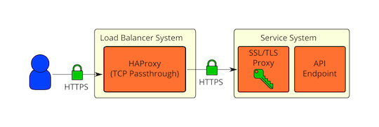

==============================
Secure reference architectures
==============================

We recommend using SSL/TLS on both public networks and
management networks in :doc:`tls-proxies-and-http-services`.
However, if actually deploying SSL/TLS everywhere is too
difficult, we recommend evaluating your OpenStack SSL/TLS needs and
following one of the architectures discussed here.

The first thing one should do when evaluating their OpenStack
SSL/TLS needs is to identify the threats. You can divide these
threats into external and internal attacker categories, but the
lines tend to get blurred since certain components of OpenStack
operate on both the public and management networks.

For publicly facing services, the threats are pretty
straightforward. Users will be authenticating against horizon and
keystone with their username and password. Users will also be
accessing the API endpoints for other services using their
keystone tokens. If this network traffic is unencrypted, passwords
and tokens can be intercepted by an attacker using a
man-in-the-middle attack. The attacker can then use these valid
credentials to perform malicious operations. All real deployments
should be using SSL/TLS to protect publicly facing services.

For services that are deployed on management networks, the
threats aren't so clear due to the bridging of security domains with
network security. There is always the chance that an administrator
with access to the management network decides to do something
malicious. SSL/TLS isn't going to help in this situation if the
attacker is allowed to access the private key. Not everyone on the
management network would be allowed to access the private key of
course, so there is still value in using SSL/TLS to protect yourself
from internal attackers. Even if everyone that is allowed to access
your management network is 100% trusted, there is still a threat
that an unauthorized user gains access to your internal network by
exploiting a misconfiguration or software vulnerability. One must
keep in mind that you have users running their own code on instances
in the OpenStack Compute nodes, which are deployed on the management
network. If a vulnerability allows them to break out of the
hypervisor, they will have access to your management network. Using
SSL/TLS on the management network can minimize the damage that an
attacker can cause.

.. _secure-communication-proxy-in-front:

SSL/TLS proxy in front
~~~~~~~~~~~~~~~~~~~~~~

It is generally accepted that it is best to encrypt
sensitive data as early as possible and decrypt it as late as
possible. Despite this best practice, it seems that it's common to
use a SSL/TLS proxy in front of the OpenStack services and use
clear communication afterwards as shown below:

.. image:: ../figures/secure-arch-ref-1.png

Some of the concerns with the use of SSL/TLS proxies as
pictured above:

* Native SSL/TLS in OpenStack services does not perform/scale
  as well as SSL proxies (particularly for Python
  implementations like Eventlet).

* Native SSL/TLS in OpenStack services not as well scrutinized/
  audited as more proven solutions.

* Native SSL/TLS configuration is difficult (not well
  documented, tested, or consistent across services).

* Privilege separation (OpenStack service processes should not
  have direct access to private keys used for SSL/TLS).

* Traffic inspection needs for load balancing.

All of the above are valid concerns, but none of them
prevent SSL/TLS from being used on the management network. Let's
consider the next deployment model.

.. _secure-communication-proxy-on-same-physical-hosts-as-api-endpoints:

SSL/TLS on same physical hosts as API endpoints
~~~~~~~~~~~~~~~~~~~~~~~~~~~~~~~~~~~~~~~~~~~~~~~

.. image:: ../figures/secure-arch-ref-2.png

This is very similar to the
:ref:`secure-communication-proxy-in-front`
but the SSL/TLS proxy is on the same physical system as
the API endpoint. The API endpoint would be configured to only
listen on the local network interface. All remote communication
with the API endpoint would go through the SSL/TLS proxy. With
this deployment model, we address a number of the bullet points in
:ref:`secure-communication-proxy-in-front`
A proven SSL implementation that performs well would be
used. The same SSL proxy software would be used for all services,
so SSL configuration for the API endpoints would be consistent.
The OpenStack service processes would not have direct access to
the private keys used for SSL/TLS, as you would run the SSL
proxies as a different user and restrict access using permissions
(and additionally mandatory access controls using something like
SELinux). We would ideally have the API endpoints listen on a Unix
socket such that we could restrict access to it using permissions
and mandatory access controls as well. Unfortunately, this does not
seem to work currently in Eventlet from our testing. It is a good
future development goal.

SSL/TLS over load balancer
~~~~~~~~~~~~~~~~~~~~~~~~~~

What about high availability or load balanced deployments
that need to inspect traffic?  The previous deployment model
(:ref:`secure-communication-proxy-on-same-physical-hosts-as-api-endpoints`)
would not allow for deep packet inspection since the traffic is
encrypted. If the traffic only needs to be inspected for basic routing
purposes, it might not be necessary for the load balancer to have
access to the unencrypted traffic. HAProxy has the ability to
extract the SSL/TLS session ID during the handshake, which can
then be used to achieve session affinity (
`session ID configuration details here <http://blog.exceliance.fr/2011/07/04/maintain-affinity-based-on-ssl-session-id/>`_
). HAProxy can also use the TLS Server Name Indication (SNI)
extension to determine where traffic should be routed to (
`SNI configuration details here <http://blog.exceliance.fr/2012/04/13/enhanced-ssl-load-balancing-with-server-name-indication-sni-tls-extension/>`_
). These features likely cover some of the most common load
balancer needs. HAProxy would be able to just pass the HTTPS traffic
straight through to the API endpoint systems in this case:

Cryptographic seperation of external and internal environments
~~~~~~~~~~~~~~~~~~~~~~~~~~~~~~~~~~~~~~~~~~~~~~~~~~~~~~~~~~~~~~

What if you want cryptographic separation of your external and
internal environments? A public cloud provider would likely want
their public facing services (or proxies) to use certificates that
are issued by a CA that chains up to a trusted Root CA that is
distributed in popular web browser software for SSL/TLS. For the
internal services, one might want to instead use their own PKI to
issue certificates for SSL/TLS. This cryptographic separation can be
accomplished by terminating SSL at the network boundary, then
re-encrypting using the internally issued certificates. The traffic
will be unencrypted for a brief period on the public facing SSL/TLS
proxy, but it will never be transmitted over the network in the
clear. The same re-encryption approach that is used to achieve
cryptographic separation can also be used if deep packet inspection
is really needed on a load balancer. Here is what this deployment
model would look like:

.. image:: ../figures/secure-arch-ref-4.png

As with most things, there are trade-offs. The main
trade-off is going to be between security and performance.
Encryption has a cost, but so does being hacked. The security and
performance requirements are going to be different for every
deployment, so how SSL/TLS is used will ultimately be an
individual decision.
