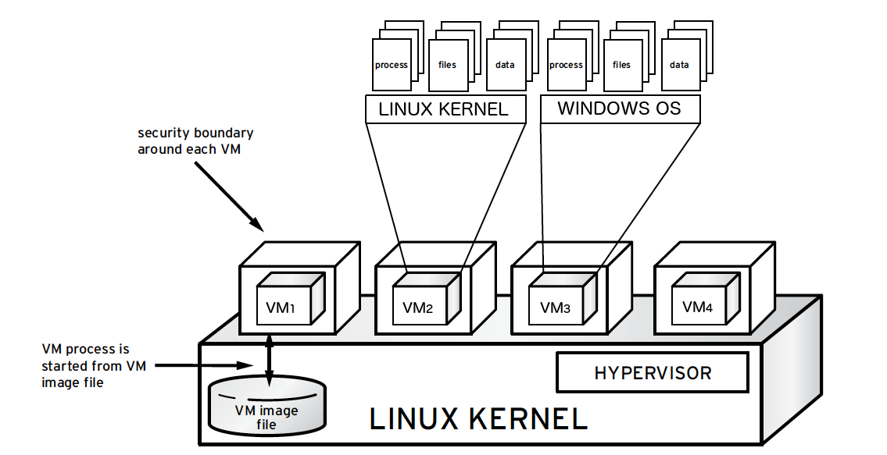

===================================
Hardening the virtualization layers
===================================

In the beginning of this chapter we discuss the use of both physical and
virtual hardware by instances, the associated security risks, and some
recommendations for mitigating those risks. Then we discuss how the Secure
Encrypted Virtualizaion tehcnology can be used to encrypt the memory of VMs on
AMD-based machines which support the technology. We conclude the chapter with a
discussion of sVirt, an open source project for integrating SELinux mandatory
access controls with the virtualization components.

Physical hardware (PCI passthrough)
~~~~~~~~~~~~~~~~~~~~~~~~~~~~~~~~~~~

Many hypervisors offer a functionality known as PCI passthrough. This allows an
instance to have direct access to a piece of hardware on the node. For example,
this could be used to allow instances to access video cards or GPUs offering
the compute unified device architecture (CUDA) for high performance
computation. This feature  carries two types of security risks: direct memory
access and hardware infection.

Direct memory access (DMA) is a feature that permits certain hardware devices
to access arbitrary physical memory addresses in the host computer. Often
video cards have this capability. However, an instance should not be given
arbitrary physical memory access because this would give it full view of both
the host system and other instances running on the same node. Hardware vendors
use an input/output memory management unit (IOMMU) to manage DMA access in
these situations. We recommend cloud architects should ensure that the
hypervisor is configured to utilize this hardware feature.

KVM:
    `How to assign devices with VT-d in KVM
    <http://www.linux-kvm.org/page/How_to_assign_devices_with_VT-d_in_KVM>`_
Xen:
    `Xen VTd Howto <http://wiki.xen.org/wiki/VTd_HowTo>`_

.. note::

   The IOMMU feature is marketed as VT-d by Intel and AMD-Vi by AMD.

A hardware infection occurs when an instance makes a malicious modification to
the firmware or some other part of a device. As this device is used by other
instances or the host OS, the malicious code can spread into those systems. The
end result is that one instance can run code outside of its security domain.
This is a significant breach as it is harder to reset the state of physical
hardware than virtual hardware, and can lead to additional exposure such as
access to the management network.

Solutions to the hardware infection problem are domain specific. The strategy
is to identify how an instance can modify hardware state then determine how to
reset any modifications when the instance is done using the hardware. For
example, one option could be to re-flash the firmware after use. There
is a need to balance hardware longevity with security as some firmwares will
fail after a large number of writes. TPM technology, described in
:ref:`management-secure-bootstrapping`, is a solution for detecting
unauthorized firmware changes. Regardless of the strategy selected, it is
important to understand the risks associated with this kind of hardware sharing
so that they can be properly mitigated for a given deployment scenario.

Due to the risk and complexities associated with PCI passthrough,
it should be disabled by default. If enabled for a specific need, you will need
to have appropriate processes in place to ensure the hardware is clean before
re-issue.

Virtual hardware (QEMU)
~~~~~~~~~~~~~~~~~~~~~~~

When running a virtual machine, virtual hardware is a software layer that
provides the hardware interface for the virtual machine. Instances use this
functionality to provide network, storage, video, and other devices that may be
needed. With this in mind, most instances in your environment will exclusively
use virtual hardware, with a minority that will require direct hardware access.
The major open source hypervisors use :term:`QEMU <Quick EMUlator (QEMU)>` for
this functionality. While QEMU fills an important need for virtualization
platforms, it has proven to be a very challenging software project to write
and maintain. Much of the functionality in QEMU is implemented with low-level
code that is difficult for most developers to comprehend. The
hardware virtualized by QEMU includes many legacy devices that have their own
set of quirks. Putting all of this together, QEMU has been the source of many
security problems, including hypervisor breakout attacks.

It is important to take proactive steps to harden QEMU. We recommend three
specific steps:

* Minimizing the code base.
* Using compiler hardening.
* Using mandatory access controls such as sVirt, SELinux, or AppArmor.

Ensure your iptables have the default policy filtering network traffic,
and consider examining the existing rule set to understand each rule and
determine if the policy needs to be expanded upon.

Minimizing the QEMU code base
~~~~~~~~~~~~~~~~~~~~~~~~~~~~~

We recommend minimizing the QEMU code base by removing unused
components from the system. QEMU provides support for many different virtual
hardware devices, however only a small number of devices are needed for a given
instance. The most common hardware devices are the virtio devices. Some legacy
instances will need access to specific hardware, which can be specified using
glance metadata:

.. code-block:: console

    $ glance image-update \
    --property hw_disk_bus=ide \
    --property hw_cdrom_bus=ide \
    --property hw_vif_model=e1000 \
    f16-x86_64-openstack-sda

A cloud architect should decide what devices to make available to cloud users.
Anything that is not needed should be removed from QEMU. This step requires
recompiling QEMU after modifying the options passed to the QEMU configure
script. For a complete list of up-to-date options simply run
:command:`./configure --help` from within the QEMU source directory. Decide
what is needed for your deployment, and disable the remaining options.

Compiler hardening
~~~~~~~~~~~~~~~~~~

Harden QEMU using compiler hardening options. Modern
compilers provide a variety of compile time options to improve the security of
the resulting binaries. These features include relocation read-only (RELRO),
stack canaries, never execute (NX), position independent executable (PIE),
and address space layout randomization (ASLR).

Many modern Linux distributions already build QEMU with compiler hardening
enabled, we recommend verifying your existing executable before
proceeding. One tool that can assist you with this
verification is called
`checksec.sh <http://www.trapkit.de/tools/checksec.html>`_

RELocation Read-Only (RELRO)
    Hardens the data sections of an executable. Both full and partial RELRO
    modes are supported by gcc. For QEMU full RELRO is your best choice.
    This will make the global offset table read-only and place various
    internal data sections before the program data section in the resulting
    executable.
Stack canaries
    Places values on the stack and verifies their presence to help prevent
    buffer overflow attacks.
Never eXecute (NX)
    Also known as Data Execution Prevention (DEP), ensures that data sections
    of the executable can not be executed.
Position Independent Executable (PIE)
    Produces a position independent executable, which is necessary for ASLR.
Address Space Layout Randomization (ASLR)
    This ensures that placement of both code and data regions will be
    randomized. Enabled by the kernel (all modern Linux kernels support ASLR),
    when the executable is built with PIE.

The following compiler options are recommend for GCC when compiling QEMU:

.. code-block:: console

   CFLAGS="-arch x86_64 -fstack-protector-all -Wstack-protector \
   --param ssp-buffer-size=4 -pie -fPIE -ftrapv -D_FORTIFY_SOURCE=2 -O2 \
   -Wl,-z,relro,-z,now"

We recommend testing your QEMU executable file after it is compiled to ensure
that the compiler hardening worked properly.

Most cloud deployments will not build software, such as QEMU, by hand. It
is better to use packaging to ensure that the process is repeatable and to
ensure that the end result can be easily deployed throughout the cloud. The
references below provide some additional details on applying compiler hardening
options to existing packages.

DEB packages:
     `Hardening Walkthrough <https://wiki.debian.org/HardeningWalkthrough>`_
RPM packages:
     `How to create an RPM package
     <http://fedoraproject.org/wiki/How_to_create_an_RPM_package>`_

Secure Encrypted Virtualization
~~~~~~~~~~~~~~~~~~~~~~~~~~~~~~~

`Secure Encrypted Virtualization (SEV) <https://developer.amd.com/sev/>`_ is a
technology from AMD which enables the the memory for a VM to be encrypted with
a key unique to the VM. SEV is available with KVM guests on certain AMD-based
machines. 

To use SEV several items must be prepared:

- The compute node machine and KVM Hypervisor need to be configured for SEV
  usage. The `KVM Hypervisor section of the Nova Configuration Guide
  <https://docs.openstack.org/nova/latest/admin/configuration/hypervisor-kvm.html>`_
  contains information needed to configure the machine and hypervisor, and
  lists several limitations of SEV.

- One or more flavors must be created that include the capability
  ``supports_amd_sev`` which maps to the ``os_trait`` of ``HW_CPU_AMD_SEV``.
  Using one of these flavors will cause the VM memory to be encrypted using
  SEV.

- The VM must be configured in a particular manner as described in the
  remainder of this section.

The VM must be the modern ``Q35`` machine type and must use UEFI firmware.
``SATA`` and ``virtio-scsi`` disks are supported. ``virtio-blk`` and IDE disks
are not supported at this time. All ``virtio`` devices need to be configured
with the ``iommu='on'`` attribute in their ``<driver>`` configuration. All
memory regions used by the VM must be locked for Direct Memory Access (DMA) to
prevent swapping.

The ``iommu`` attribute must be ``on`` for all virtio devices.  Despite the
name, this does not require the guest or host to have an IOMMU device, but
merely enables the virtio flag which indicates that virtualized DMA should be
used.

The domain must include a <launchSecurity type='sev'> section as shown in the
example below.

All the memory regions allocated by QEMU must be pinned, so that they cannot
be swapped to disk.  This can be achieved by setting a hard memory limit via
``<hard_limit>`` in the ``<memtune>`` section of the domain's XML.  This does
not reflect a requirement for additional memory; it is only required in order
to achieve the memory pinning.

Another method for pinning the memory is to enable `hugepages
<https://docs.openstack.org/nova/latest/admin/huge-pages.html>`_ by booting
with the ``hw:mem_page_size=large`` property set either on the flavor or the
image, although using this method may require undesirable duplication of
flavors or images.

Note that this memory pinning is expected to be a temporary requirement; the
latest firmware versions already support page copying, so when the OS starts
supporting the page-move or page-migration commmand then it will no longer be
needed.

Based on instrumentation of QEMU, the limit per VM should be calculated and
accounted for as follows:

=======================  =====================  ==========================
Memory region type       Size                   Accounting mechanism
=======================  =====================  ==========================
VM RAM                   set by flavor          placement service
video memory             set by flavor/image    placement service
UEFI ROM                 4096KB                 `reserved_host_memory_mb`_
UEFI var store (pflash)  4096KB                 `reserved_host_memory_mb`_
pc.rom                   128KB                  `reserved_host_memory_mb`_
isa-bios                 128KB                  `reserved_host_memory_mb`_
ACPI tables              2384KB                 `reserved_host_memory_mb`_
=======================  =====================  ==========================

.. _reserved_host_memory_mb:
   https://docs.openstack.org/nova/latest/configuration/config.html#DEFAULT.reserved_host_memory_mb

It is also recommended to include an additional padding of at least 256KB for
safety, since ROM sizes can occasionally change. For example the total of
10832KB required here for ROMs / ACPI tables could be rounded up to 16MB.

The first two values are expected to commonly vary per VM, and are already
accounted for dynamically by the placement service.

The remainder have traditionally (i.e. for non-SEV instances) been accounted
for alongside the overhead for the host OS via nova's memory pool defined by
the `reserved_host_memory_mb`_ config option, and this does not need to
change.  However, whilst the overhead incurred is no different to that
required for non-SEV instances, it is much more important to get the hard
limit right when pinning memory; if the limit is too low the VM will get
killed, and if the limit is too high there is a risk of the host's OOM killer
being invoked, or failing that, the host crashing because it cannot reclaim
the memory used by the guest.

So as an example a 4GB VM would contain the following XML configuration:

  .. code-block:: ini

     <domain type='kvm'>
       <os>
         <type arch='x86_64' machine='pc-q35-2.11'>hvm</type>
         <loader readonly='yes' type='pflash'>/usr/share/qemu/ovmf-x86_64-ms-4m-code.bin</loader>
         <nvram>/var/lib/libvirt/qemu/nvram/sles15-sev-guest_VARS.fd</nvram>
         <boot dev='hd'/>
       </os>
       <launchSecurity type='sev'>
         <cbitpos>47</cbitpos>
         <reducedPhysBits>1</reducedPhysBits>
         <policy>0x0037</policy>
       </launchSecurity>
       <memtune>
         <hard_limit unit='KiB'>4718592</hard_limit>
         ...
       </memtune>
       <devices>
         <rng model='virtio'>
           <driver iommu='on'/>
           ...
         </rng>
         <memballoon model='virtio'>
           <driver iommu='on' />
           ...
         </memballoon>
         ...
         <video>
           <model type='qxl' ram='65536' vram='65536' vgamem='16384' heads='1'  primary='yes'/>
         </video>
         ...
       </devices>
       ...
     </domain>

``cbitpos`` and ``reducedPhysBits`` are dependent on the processor family, and
can be obtained through the ``sev`` element from `the domain capabilities
<https://libvirt.org/formatdomaincaps.html#elementsSEV>`_.

``policy`` specifies a particular SEV policy as documented in `the AMD SEV-KM
API Specification <https://developer.amd.com/wp-content/resources/55766.PDF>`_.

Mandatory access controls
~~~~~~~~~~~~~~~~~~~~~~~~~

Compiler hardening makes it more difficult to attack the QEMU process. However,
if an attacker does succeed, you want to limit the impact of the attack.
Mandatory access controls accomplish this by restricting the privileges on QEMU
process to only what is needed. This can be accomplished by using sVirt,
SELinux, or AppArmor. When using sVirt, SELinux is configured to run each QEMU
process under a separate security context. AppArmor can be configured to
provide similar functionality. We provide more details on sVirt and instance
isolation in the section below
:ref:`hardening-the-virtualization-layers-svirt-selinux-and-virtualization`.

Specific SELinux policies are available for many OpenStack services. CentOS
users can review these policies by `installing the selinux-policy source
package`_. The most up to date policies appear in `Fedora's selinux-policy`_
repository. The `rawhide-contrib`_ branch has files that end in ``.te``, such
as ``cinder.te``, that can be used on systems running SELinux.

AppArmor profiles for OpenStack services do not currently exist, but the
OpenStack-Ansible project handles this by `applying AppArmor profiles to each
container`_ that runs an OpenStack service.

.. _installing the selinux-policy source package: https://wiki.centos.org/HowTos/RebuildSRPM
.. _Fedora's selinux-policy: https://github.com/fedora-selinux/selinux-policy
.. _rawhide-contrib: https://github.com/fedora-selinux/selinux-policy/tree/rawhide-contrib
.. _applying AppArmor profiles to each container: https://docs.openstack.org/project-deploy-guide/openstack-ansible/draft/app-security.html

.. _hardening-the-virtualization-layers-svirt-selinux-and-virtualization:

sVirt: SELinux and virtualization
~~~~~~~~~~~~~~~~~~~~~~~~~~~~~~~~~

With unique kernel-level architecture and National Security Agency (NSA)
developed security mechanisms, KVM provides foundational isolation technologies
for multi-tenancy. With developmental origins dating back to 2002, the Secure
Virtualization (sVirt) technology is the application of SELinux against modern
day virtualization. SELinux, which was designed to apply separation control
based upon labels, has been extended to provide isolation between virtual
machine processes, devices, data files and system processes acting upon their
behalf.

OpenStack's sVirt implementation aspires to protect hypervisor hosts and
virtual machines against two primary threat vectors:

Hypervisor threats
    A compromised application running within a virtual machine attacks the
    hypervisor to access underlying resources. For example, when a virtual
    machine is able to access the hypervisor OS, physical devices, or other
    applications. This threat vector represents considerable risk as a
    compromise on a hypervisor can infect the physical hardware as well as
    exposing other virtual machines and network segments.
Virtual Machine (multi-tenant) threats
    A compromised application running within a VM attacks the hypervisor to
    access or control another virtual machine and its resources. This is a
    threat vector unique to virtualization and represents considerable risk as
    a multitude of virtual machine file images could be compromised due to
    vulnerability in a single application. This virtual network attack is a
    major concern as the administrative techniques for protecting real
    networks do not directly apply to the virtual environment.

Each KVM-based virtual machine is a process which is labeled by SELinux,
effectively establishing a security boundary around each virtual machine. This
security boundary is monitored and enforced by the Linux kernel, restricting
the virtual machine's access to resources outside of its boundary, such as host
machine data files or other VMs.

sVirt isolation is provided regardless of the guest operating
system running inside the virtual machine. Linux or Windows VMs can be
used. Additionally, many Linux distributions provide SELinux within the
operating system, allowing the virtual machine to protect internal virtual
resources from threats.

Labels and categories
~~~~~~~~~~~~~~~~~~~~~

KVM-based virtual machine instances are labelled with their own SELinux data
type, known as ``svirt_image_t``. Kernel level protections prevent unauthorized
system processes, such as malware, from manipulating the virtual machine image
files on disk. When virtual machines are powered off, images are stored as
``svirt_image_t`` as shown below:

.. code-block:: console

   system_u:object_r:svirt_image_t:SystemLow image1
   system_u:object_r:svirt_image_t:SystemLow image2
   system_u:object_r:svirt_image_t:SystemLow image3
   system_u:object_r:svirt_image_t:SystemLow image4

The ``svirt_image_t`` label uniquely identifies image files on disk, allowing
for the SELinux policy to restrict access. When a KVM-based compute image is
powered on, sVirt appends a random numerical identifier to the image. sVirt is
capable of assigning numeric identifiers to a maximum of 524,288 virtual
machines per hypervisor node, however most OpenStack deployments are highly
unlikely to encounter this limitation.

This example shows the sVirt category identifier:

.. code-block:: console

   system_u:object_r:svirt_image_t:s0:c87,c520 image1
   system_u:object_r:svirt_image_t:s0:419,c172 image2

SELinux users and roles
~~~~~~~~~~~~~~~~~~~~~~~

SELinux manages user roles. These can be viewed through the ``-Z`` flag,
or with the :command:`semanage` command. On the hypervisor, only administrators
should be able to access the system, and should have an appropriate context
around both the administrative users and any other users that are on the
system. For more information, see the `SELinux users documentation
<http://selinuxproject.org/page/BasicConcepts#Users>`_.

Booleans
~~~~~~~~

To ease the administrative burden of managing SELinux, many enterprise Linux
platforms utilize SELinux Booleans to quickly change the security posture of
sVirt.

Red Hat Enterprise Linux-based KVM deployments utilize the following sVirt
booleans:

.. list-table::
   :header-rows: 1
   :widths: 10 20

   * - sVirt SELinux Boolean
     - Description
   * - virt_use_common
     - Allow virt to use serial or parallel communication ports.
   * - virt_use_fusefs
     - Allow virt to read FUSE mounted files.
   * - virt_use_nfs
     - Allow virt to manage NFS mounted files.
   * - virt_use_samba
     - Allow virt to manage CIFS mounted files.
   * - virt_use_sanlock
     - Allow confined virtual guests to interact with the sanlock.
   * - virt_use_sysfs
     - Allow virt to manage device configuration (PCI).
   * - virt_use_usb
     - Allow virt to use USB devices.
   * - virt_use_xserver
     - Allow virtual machine to interact with the X Window System.
