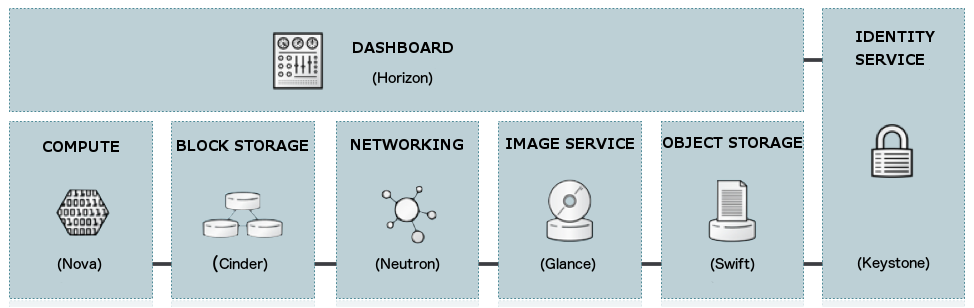

=========================
Introduction to OpenStack
=========================

This guide provides security insight into :term:`OpenStack` deployments. The
intended audience is cloud architects, deployers, and administrators. In
addition, cloud users will find the guide both educational and helpful in
provider selection, while auditors will find it useful as a reference document
to support their compliance certification efforts. This guide is also
recommended for anyone interested in cloud security.

Each OpenStack deployment embraces a wide variety of technologies, spanning
Linux distributions, database systems, messaging queues, OpenStack components
themselves, access control policies, logging services, security monitoring
tools, and much more. It should come as no surprise that the security issues
involved are equally diverse, and their in-depth analysis would require several
guides. We strive to find a balance, providing enough context to understand
OpenStack security issues and their handling, and provide external references
for further information. The guide could be read from start to finish or
sampled as necessary like a reference.

We briefly introduce the kinds of clouds: private, public, and hybrid before
presenting an overview of the OpenStack components and their related security
concerns in the remainder of the chapter.

Cloud types
~~~~~~~~~~~

OpenStack is a key enabler in adoption of cloud technology and has several
common deployment use cases. These are commonly known as Public, Private, and
Hybrid models. The following sections use the National Institute of Standards
and Technology (NIST) `definition of cloud
<http://nvlpubs.nist.gov/nistpubs/Legacy/SP/nistspecialpublication800-145.pdf>`__
to introduce these different types of cloud as they apply to OpenStack.

Public cloud
------------

According to NIST, a public cloud is one in which the infrastructure is open to
the general public for consumption. OpenStack public clouds are typically run
by a :term:`service provider` and can be consumed by individuals, corporations,
or any paying customer. A public cloud provider may expose a full set of
features such as software-defined networking, block storage, in addition to
multiple instance types. Due to the nature of public clouds, they are exposed
to a higher degree of risk. As a consumer of a public cloud you should validate
that your selected provider has the necessary certifications, attestations, and
other regulatory considerations. As a public cloud provider, depending on your
target customers, you may be subject to one or more regulations.  Additionally,
even if not required to meet regulatory requirements, a provider should ensure
tenant isolation as well as protecting management infrastructure from external
attacks.

Private cloud
-------------

At the opposite end of the spectrum is the private cloud. As NIST defines it, a
private cloud is provisioned for exclusive use by a single organization
comprising multiple consumers, such as business units. It may be owned,
managed, and operated by the organization, a third-party, or some combination
of them, and it may exist on or off premises.  Private cloud use cases are
diverse, as such, their individual security concerns vary.

Community cloud
---------------

NIST defines a community cloud as one whose infrastructure is provisioned for
the exclusive use by a specific community of consumers from organizations that
have shared concerns. For example, mission, security requirements, policy, and
compliance considerations. It may be owned, managed, and operated by one or
more of the organizations in the community, a third-party, or some combination
of them, and it may exist on or off premises.

Hybrid cloud
------------

A hybrid cloud is defined by NIST as a composition of two or more distinct
cloud infrastructures, such as private, community, or public, that remain
unique entities, but are bound together by standardized or proprietary
technology that enables data and application portability, such as cloud
bursting for load balancing between clouds. For example an online retailer may
have their advertising and catalogue presented on a public cloud that allows
for elastic provisioning. This would enable them to handle seasonal loads in a
flexible, cost-effective fashion.  Once a customer begins to process their
order, they are transferred to the more secure private cloud back end that is
PCI compliant.

For the purposes of this document, we treat community and hybrid similarly,
dealing explicitly only with the extremes of public and private clouds from a
security perspective. Your security measures depend where your deployment falls
upon the private public continuum.

OpenStack service overview
~~~~~~~~~~~~~~~~~~~~~~~~~~

OpenStack embraces a modular architecture to provide a set of core services
that facilitates scalability and elasticity as core design tenets. This chapter
briefly reviews OpenStack components, their use cases and security
considerations.

Compute
-------

OpenStack :term:`Compute` service (nova) provides services to support the
management of virtual machine instances at scale, instances that host
multi-tiered applications, dev/test environments, "Big Data" crunching
Hadoop clusters, and/or high performance computing.

The Compute service facilitates this management through an abstraction layer
that interfaces with supported hypervisors, which we address later on in more
detail.

Later in the guide, we focus generically on the virtualization stack as it
relates to hypervisors.

For information about the current state of feature support, see `OpenStack
Hypervisor Support Matrix
<https://wiki.openstack.org/wiki/HypervisorSupportMatrix>`__.

The security of Compute is critical for an OpenStack deployment.  Hardening
techniques should include support for strong instance isolation, secure
communication between Compute sub-components, and resiliency of public-facing
API endpoints.

Object Storage
--------------

The OpenStack :term:`Object Storage` service (swift) provides support for
storing and retrieving arbitrary data in the cloud. The Object Storage
service provides both a native API and an Amazon Web Services S3 compatible
API. The service provides a high degree of resiliency through data replication
and can handle petabytes of data.

It is important to understand that object storage differs from traditional file
system storage. It is best used for static data such as media files (MP3s,
images, videos), virtual machine images, and backup files.

Object security should focus on access control and encryption of data in
transit and at rest. Other concerns may relate to system abuse, illegal or
malicious content storage, and cross authentication attack vectors.

Block Storage
-------------

The OpenStack :term:`Block Storage` service (cinder) provides persistent block
storage for compute instances. The Block Storage service is responsible for
managing the life-cycle of block devices, from the creation and attachment of
volumes to instances, to their release.

Security considerations for block storage are similar to that of object
storage.

Shared File Systems
-------------------

The :term:`Shared File Systems service` (manila) provides a set of services
for management of shared file systems in a multi-tenant cloud environment,
similar to how OpenStack provides for block-based storage management through
the OpenStack Block Storage service project. With the Shared File Systems
service, you can create a remote file system, mount the file system on your
instances, and then read and write data from your instances to and from your
file system.

Networking
----------

The OpenStack :term:`Networking` service (neutron, previously called quantum)
provides various networking services to cloud users (tenants) such as
IP address management, DNS, DHCP, load balancing, and security groups
(network access rules, like firewall policies). It provides a framework for
software defined networking (SDN) that allows for pluggable integration with
various networking solutions.

OpenStack Networking allows cloud tenants to manage their guest network
configurations. Security concerns with the networking service include network
traffic isolation, availability, integrity and confidentiality.

Dashboard
---------

The OpenStack :term:`dashboard` (horizon) provides a web-based interface for
both cloud administrators and cloud tenants. Through this interface
administrators and tenants can provision, manage, and monitor cloud resources.
Horizon is commonly deployed in a public facing manner with all the usual
security concerns of public web portals.

Identity service
----------------

The OpenStack :term:`Identity` service (keystone) is a **shared service** that
provides authentication and authorization services throughout the entire cloud
infrastructure. The Identity service has pluggable support for multiple forms
of authentication.

Security concerns here pertain to trust in authentication, management of
authorization tokens, and secure communication.

Image service
-------------

The OpenStack :term:`Image service` (glance) provides disk image management
services. The Image service provides image discovery, registration, and
delivery services to the Compute service, as needed.

Trusted processes for managing the life cycle of disk images are required, as
are all the previously mentioned issues with respect to data security.

Data processing service
-----------------------

The :term:`Data processing service` for OpenStack (sahara) provides a platform
for the provisioning, management, and usage of clusters running popular
processing frameworks.

Security considerations for data processing should focus on data privacy and
secure communications to provisioned clusters.

Other supporting technology
---------------------------

OpenStack relies on messaging for internal communication between several of
its services. By default, OpenStack uses message queues based on the
:term:`AMQP <Advanced Message Queuing Protocol (AMQP)>`. Similar to most
OpenStack services, it supports pluggable components. Today the implementation
back end could be RabbitMQ, Qpid, or ZeroMQ.

As most management commands flow through the message queuing system, it is a
primary security concern for any OpenStack deployment. Message queuing security
is discussed in detail later in this guide.

Several of the components use databases though it is not explicitly called out.
Securing the access to the databases and their contents is yet another security
concern, and consequently discussed in more detail later in this guide.
