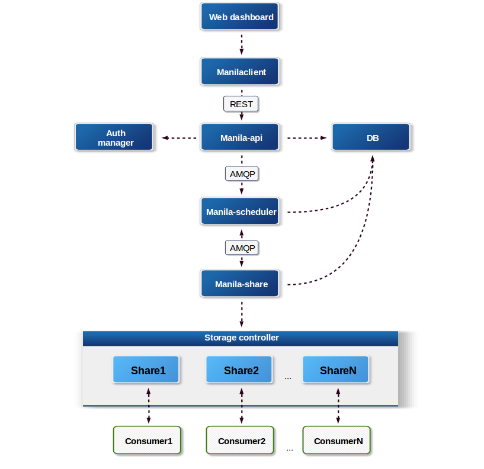

.. _shared_fs_intro:

Introduction
------------
The Shared File Systems service (manila) is intended to be ran on a single-node
or across multiple nodes. The Shared File Systems service consists of three
main services, which are similar to those of the Block Storage service:

- ``manila-api``
- ``manila-scheduler``
- ``manila-share``

The Shared File Systems service uses a SQL-based central database that is
shared by all Shared File Systems services in the system. The amount and depth
of the data fits into a SQL database quite well. The Shared File Systems
service can use all SQL dialects supported by ORM SQLALchemy, but is tested
only with MySQL and PostgreSQL data bases.

Using SQL, the Shared File Systems service is similar to other OpenStack
services and can be used with any OpenStack deployment. For more details on
the API, see the `OpenStack Shared File Systems API <http://developer.
openstack.org/api-ref-share-v2.html>`_ description. For mode details of the CLI
using and configuring, see `Shared File Systems Cloud Administrative Guide
<http://docs.openstack.org/admin-guide-cloud/shared_file_systems.html>`_.

Below is an explanation of the different components.

``manila-api``
   The service that provides a stable RESTful API. The service
   authenticates and routes requests throughout the Shared Filesystem
   service. There is python-manilaclient to interact with the API.
   For more details on the Shared File Systems API, see the `OpenStack
   Shared File Systems API <http://developer.openstack.org/api-ref-share-
   v2.html>`_.
``manila-share``
   Responsible for managing Shared File Service devices, specifically the
   back-end devices.
``manila-scheduler``
   Responsible for scheduling and routing requests to the appropriate
   ``manila-share`` service. It does that by picking one back-end while
   filtering all except one back-end.
python-manilaclient
   Command line interface to interact with the Shared File Systems service
   via ``manila-api`` and also a Python module to interact programmatically
   with the Shared File Systems service.
Storage controller
   Typically a metal box with spinning disks, ethernet ports, and some
   kind of software that allows network clients to read and write files on
   the disks. There are also software-only storage controllers that run on
   arbitrary hardware, clustered controllers which may run allow a
   multiple physical devices to appear as a single storage controller, or
   purely virtual storage controllers.

A share is a remote, mountable file system. You can mount a share to and access
a share from several hosts by several users at a time.

The Shared File Systems service can work with different network types, which
can be flat, VLAN, VXLAN, or GRE, and supports segmented networking. There are
also different :ref:`network plug-ins <shared_fs_network_plugins>` that provide
a variety of integration approaches with the network services that are
available with OpenStack.

There are a large number of share drivers created by different vendors. Each
share driver is a Python class that can be set for the back end and run in the
back end to manage the share operations, some of which are vendor-specific.
The back end is an instance of the manila-share service. For example, the
service can be configured to use NetApp Clustered Data ONTAP (cDOT), Huawei NAS
Driver, GlusterFS Native driver, and so on.

The configuration information for clients for authentication and authorization
can be stored by :ref:`security services <shared_fs_security_services>`.
This means that such protocols as LDAP and Kerberos, or with Microsoft Active
directory authentication service can be configured and used.

Unless it is not modified in the ``policy.json``, either an administrator or
the tenant that owns a share always is able to manage the :ref:`access to the
shares <shared_fs_share_acl>` by means of creating access rules with
authentication though IP address, user, group, or TLS certificates. The
authentication methods depend on which share driver and security service you
configure and use.

.. note::

    Different access features are supported by different share drivers with
    taking into consideration the shared file system protocol. The supported
    shared file system protocols are NFS, CIFS, GlusterFS, or HDFS. As the
    example, the Generic (Block Storage as a back end) driver does not support
    user and certificate authentication methods. It also does not support any
    of the security services, such as LDAP, Kerberos, or Active Directory. For
    details of supporting of features by different drivers, see `Manila share
    features support mapping <http://docs.openstack.org/developer/manila/
    devref/share_back_ends_feature_support_mapping.html>`_.

As administrator, you can create the share types that enable the scheduler to
filter the back ends before you create a share. The share types have the extra
specifications you can set in the type for scheduler to filter and weigh back
ends so that an appropriate one is selected for the user that requests the
share creation. An administrator can add
:ref:`access to the private share types <shared_fs_share_types_acl>` for
definite users or tenants in the Identity service. Thus the users which you
granted access can see available share types and create shares using them.

The shares and share types can be created as public or private. This level of
visibility defines whether other tenants are able to see these objects and
operate with them, or not.

The permissions of API calls for different users and their roles are determined
by :ref:`policies <shared_fs_policies>` as well as other OpenStack services.

The Identity service with different back ends, for example, LDAP, Active
Directory, can be used for the authentication in the Shared File Systems. See
details of the identity service security in :doc:`../identity` section.

General security information
^^^^^^^^^^^^^^^^^^^^^^^^^^^^

Similar to other OpenStack projects, the Shared File Systems service is
registered with the Identity service, so you can find the API endpoints of the
share service v1 and v2 using **manila endpoints** command:

.. code:: console

 +-------------+-----------------------------------------+
 | manila      | Value                                   |
 +-------------+-----------------------------------------+
 | adminURL    | http://172.18.198.55:8786/v1/20787a7b...|
 | region      | RegionOne                               |
 | publicURL   | http://172.18.198.55:8786/v1/20787a7b...|
 | internalURL | http://172.18.198.55:8786/v1/20787a7b...|
 | id          | 82cc5535aa444632b64585f138cb9b61        |
 +-------------+-----------------------------------------+

 +-------------+-----------------------------------------+
 | manilav2    | Value                                   |
 +-------------+-----------------------------------------+
 | adminURL    | http://172.18.198.55:8786/v2/20787a7b...|
 | region      | RegionOne                               |
 | publicURL   | http://172.18.198.55:8786/v2/20787a7b...|
 | internalURL | http://172.18.198.55:8786/v2/20787a7b...|
 | id          | 2e8591bfcac4405fa7e5dc3fd61a2b85        |
 +-------------+-----------------------------------------+

By default, the Shared File Systems API service listens only on the port
``8786`` with ``tcp6`` type that supports both IPv4 and IPv6.

.. note::
    The port ``8786`` is the default port for the Shared File Systems service.
    It may be changed to any other port, but this change should also be made
    in the configuration file using option ``osapi_share_listen_port`` which
    defaults to ``8786``.

In ``/etc/manila/`` directory you can find the environment configuration files:

.. code:: console

 api-paste.ini
 manila.conf
 policy.json
 rootwrap.conf
 rootwrap.d

 ./rootwrap.d:
 share.filters

It is recommended that you configure the Shared File Systems service to run
under a non-root service account, for example, ``manila`` and change file
permissions for only ``root`` to be able to modify the configuration files. The
Shared File Systems service expects that only the administrator can write to
the configuration files and the services can only read them through their group
membership in the ``manila`` group. Others must not be able to read these files
because the files contain admin passwords of different services.

Thus, for the configuration files it is recommended to set ownership to
``root/manila`` and access permissions to ``640`` allowing only root to write
to the configuration files, and other users in the ``manila`` group to read
them. For details, see :ref:`check_shared_fs_01` and :ref:`check_shared_fs_02`
in a checklist.

.. note::

    The configuration for manila-rootwrap in file ``rootwrap.conf`` and the
    manila-rootwrap command filters for share nodes in file
    ``rootwrap.d/share.filters`` should be owned by, and only-writeable by, the
    root user.

.. tip::

    Manila configuration file ``manila.conf`` may be used from different places.
    The path ``/etc/manila/manila.conf`` is one of expected paths by default.
