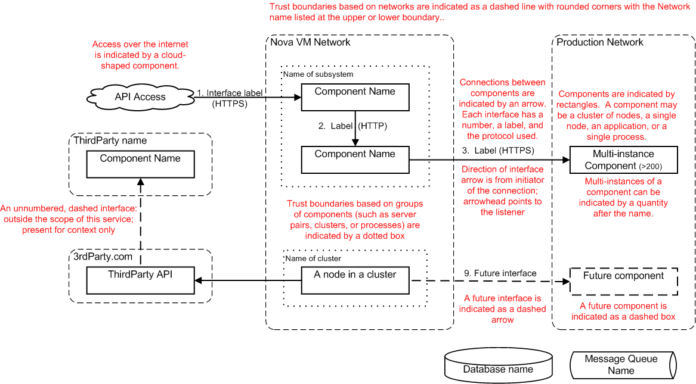
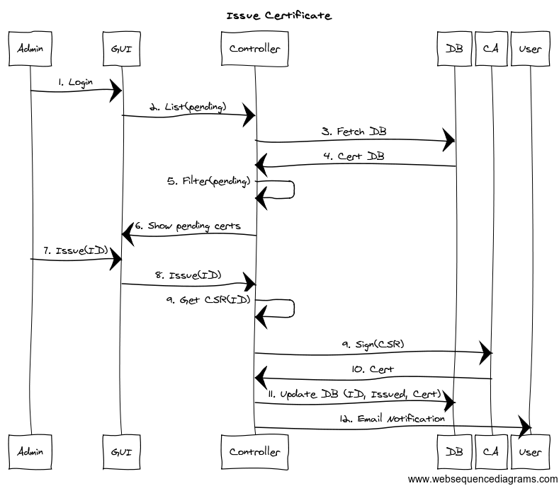

.. _architecture-diagram-guidance:

=============================
Architecture diagram guidance
=============================

Types of diagrams required
--------------------------

This page provides guidance on architecture diagrams for threat
analysis, a template for architecture documentation is available at <link>.

Two types of diagrams are required for threat analysis:

-  A service architecture diagram
-  One or more information flow diagrams (either data flow diagrams,
   sequence diagrams, or both)

Examples of each of these are given below. There are no firm diagramming
toolchain requirements, but the tool used must be able to draw the diagrams
discussed. It is generally preferable to use a text-based diagram
generator so diagrams can be managed with gerrit. Some options for tools
include:

- draw.io (proprietary XML files, but very easy to use)
- Google drawing (no XML/text output, but can be used collaboratively)
- blockdiag (non-WYSIWYG with a steeper learning curve, suitable for very
  simple diagrams)

When drawing architecture diagrams, it may be beneficial to draw the diagram on
paper or a whiteboard before attempting to draw it with a diagramming tool.

When you have completed the diagram, export both a text version (if available)
and a Portable Network Graphic (.png) file to be committed to the repository
with the architecture page.

Service architecture diagram requirements
-----------------------------------------

Service Architecture diagrams contain these elements:

-  Components

   -  A rectangle containing a unique name is used to depict each
      component
   -  Components may be servers, clusters, or individual
      processes

   -  Standard component shapes should be used to illustrate component
      types

      -  A vertical cylinder indicates storage or a database
      -  A horizontal cylinder (a "pipe" shape) indicates a message
         queue (use an elongated rectangle if horizontal cylinders are
         unavailable)

   -  A dashed rectangle indicates a future component
   -  Multi-instances of a component should be indicated by a quantity after
      the component name, for example (100), and if possible layered component
      boxes
   -  Component shapes don't need to be all the same size. Some component
      shapes may be shrunk to allow application layers to be easily recognized,
      without creating a maze of crossed interface lines
   -  User access over the internet can be indicated by a cloud-shaped
      component, but where multiple connections or external parties are
      connected via the internet, a separate internet trust domain should be
      shown

-  Interfaces

   -  An arrow connecting two components is used to depict an interface
   -  Each interface has a unique number and name; listing the network
      protocol (in parenthesis) is strongly recommended
   -  Direction of interface arrow is from the component initiating the
      connection; the arrowhead points to the listening/receiving component
   -  A future interface is indicated as a dashed arrow

-  Trust domains

   -  Boundaries between trust domains must be shown
   -  Trust boundaries based on networks are indicated as a dashed line
      (preferably with rounded corners), with the Network name listed at the
      upper or lower boundary
   -  Trust boundaries based on groups of components (such as server pairs,
      clusters, processes, or collections of related components) are indicated
      by a dotted box
   -  When a third party network boundary is used to illustrate a trust domain,
      use that third party's name as the network boundary label

Service architecture diagram template
-------------------------------------

This template illustrates the elements of a service architecture diagram.

Information flow diagram requirements
-------------------------------------

Information flow diagrams depict the flow of data between entities to
illustrate the steps in a process or procedure. Often, multiple diagrams
are created to illustrate individual use cases.

Each information flow diagram must be in the form of either a data flow
diagram (DFD) or a sequence diagram. The architect may select either
type of diagram (or both) for illustrating information flows within the
service.

Information flow diagrams contain the following elements:

-  Entities

   -  An entity may be a single process, multiple processes within a trust
      domain, a data store, or an external entity.
   -  Each entity has a unique name which should match a name on the
      architecture diagram
   -  The number of entities on a flow diagram often matches the number of
      components on a service architecture diagram.

-  Data flows

   -  Arrows indicate data flows between entities; the direction of the
      arrow indicates the direction of data movement
   -  Any pair of entities may have multiple sets of arrows to
      illustrate a multi-step exchange of data between the entities
   -  Typically every interface on a service architecture diagram has
      one or more corresponding data flows on a flow diagram

-  Trust boundaries

   -  Groups of entities with the same level of privilege form a trust
      domain, the boundaries of which are indicated by a dashed line in
      DFDs and by a shallow rectangle on sequence diagrams

-  Optional supplementary information

   -  Textual notes on the diagram can provide clarification on data
      types sent and received, changes in privilege, or steps forming a
      use case

Data flow diagram template
~~~~~~~~~~~~~~~~~~~~~~~~~~

This template illustrates the elements of a data flow diagram.

.. image:: figures/Template_DFD.png

Sequence diagram template
~~~~~~~~~~~~~~~~~~~~~~~~~

The following template illustrates the elements of a sequence diagram.

.. image:: figures/Template_Sequence-diagram.png

Sequence diagrams can be quickly and easily generated from text using
http://WebSequenceDiagrams.com . Enter a specification using a simple scripting
language, as follows. Be sure to include authentication steps in your diagram.

title Issue Certificate

Admin->GUI: 1. Login

GUI->Controller: 2. List(pending)

Controller->DB: 3. Fetch DB

DB->Controller: 4. Cert DB

Controller->Controller: 5. Filter(pending)

Controller->GUI: 6. Show pending certs

Admin->GUI: 7. Issue(ID)

GUI->Controller: 8. Issue(ID)

Controller->Controller: 9. Get CSR(ID)

Controller->CA: 9. Sign(CSR)

CA->Controller: 10. Cert

Controller->DB: 11. Update DB (ID, Issued, Cert)

Controller->User: 12. Email Notification

The tool creates a sequence diagram as follows:

