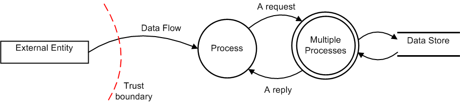
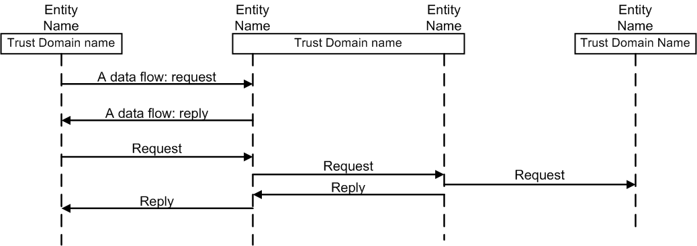

.. _architecture-page:

==========================
Architecture page template
==========================

Project name architecture - version/release
===========================================

**Status**: Draft/Ready for Review/Reviewed

**Release**: Juno/Kilo/Liberty if applicable

**Version**: 0.01 if applicable

**Contacts**:

- PTL: name - irc handle

- Architect: name - irc handle

- Security Reviewer: name - irc handle

Project description and purpose
~~~~~~~~~~~~~~~~~~~~~~~~~~~~~~~

A brief description of the purpose of the project. This should be a paragraph
or two and can be cut/paste from wiki or other documentation. Include links
to relevant presentations and further documentation if available.

Primary users and use-cases
~~~~~~~~~~~~~~~~~~~~~~~~~~~

A short statement about the expected primary users of the implemented
architecture, 'users' can either be actors or other services within OpenStack.

For example:

#. Administrators will use this tool to manage storage quotas
#. Nova will fetch TLS certificates for nova-migrate
#. IaaS services e.g cinder, neutron-lbaas and nova for encryption key
   generation and storage.

Differences from previous architecture
~~~~~~~~~~~~~~~~~~~~~~~~~~~~~~~~~~~~~~

If this is a revision of a prior architecture, briefly list the new components
and interfaces. If this is a new architecture that replaces a prior service,
briefly describe how this service differs from its ancestor. If this is an
entirely new service with no precedent or one that has not been reviewed
previously, then remove this section.

External dependencies & associated security assumptions
~~~~~~~~~~~~~~~~~~~~~~~~~~~~~~~~~~~~~~~~~~~~~~~~~~~~~~~

External dependencies are items outside of the control of the service that are
required for its operation, and may impact the service if they were compromised
or became unavailable. These items are usually outside the control of the
developer but within the control of the deployer, but may be operated by a
third party.

For example:

- Nova compute service is configured in accordance with security best practice.
- AWS object storage.

Components
~~~~~~~~~~

In the component descriptions that follow, I-C means that in a typical
deployment, they reside in hosted instances on the cloud, and U-C means they
are likely to be in the under cloud infrastructure. O-C means they are outside
of the cloud.

- component-1 (optional product/technology name)[I-C or U-C]: Describe
  component
- component-2 [I-C]: Describe component
- component-3 [U-C]: Describe component
- component-3 [O-C]: Describe component or service

For Example:

- Worker Queue (rabbitmq) [U-C]: This queue is used to process new order
  requests. Other systems involved submit and receive data via this queue.
- Database (MySQL) [I-C or U-C]: Open-source sql database to store Barbican
  state data related to its managed entities and their metadata.

Interfaces
~~~~~~~~~~
.. csv-table::
   :header: "Interface","Network name","Network protocol","Requestor","Request","Request credentials","Request authorization","Listener","Response","Response credentials","Description of operation"

   "1"
   "2"
   "3"

Guidance:

- Enter a component name in the Requestor and Listener columns.
- Enter a data asset name in the Request and Response columns.
- Do not use an interface to show a function call within the same process.
- It is appropriate to show calls or effects which a process or library
  makes outside of the process. For example, if the project is responsible for
  part of a process, such as a library, do not list intra-process calls to that
  library as separate interfaces. On the service architecture diagram you can
  show the process and the library and color-code them to show the part(s) for
  which the project has responsibility.
- If a request uses mutual TLS authentication (using both a client and server
  certificate) then it may be appropriate to list 'TLS Certificate' in the
  'Request credentials field' for that interface, but otherwise TLS should not
  be regarded as a credential. The following examples attempt to clarify this
  for common situations:

  - Over an HTTPS session a service sends a Keystone token to authenticate
    itself. In this case the Request credential is the Keystone token and the
    Network protocol is HTTPS.
  - A service connects to a database using SQL with a username and password.
    Customers have the option at installation time to set up TLS for this
    connection but are not required to do so.  In this case list the most
    secure available option in the interfaces table: the Network protocol is
    "SQL with TLS" and the Request credentials are "username/password".

Service architecture diagram
~~~~~~~~~~~~~~~~~~~~~~~~~~~~

Insert Service Architecture diagram here. For diagram requirements see
Architecture Diagram guidance.

Data assets
~~~~~~~~~~~

The following is the description of data assets used by this service. See the
TODO Information Classification Handling Policy for an explanation of
requirements associated with the Confidentiality and Availability labels.

.. csv-table::
  :header: "Data name","Confidentiality","Integrity","Availability","Description"

  "System request","Confidential","High","Medium","Requests between OpenStack services"
  "System reply","Confidential","High","Medium","Replies to System requests"
  "Data type X","Confidential","High","High","Data in motion, not stored"
  "Data type Y","Confidential","High","Medium","Parameters in config file."
  "MySQL database","Confidential","High","High","Contains user preferences. Backup to Swift daily."

Data flow diagram(s)
~~~~~~~~~~~~~~~~~~~~

Insert DFDs here. If you prefer to use sequence diagrams, then delete this
section. Architecture documentation should have at least one DFD or sequence
diagram.

An example of a data flow diagram is shown below:

Sequence diagram(s)
~~~~~~~~~~~~~~~~~~~

Insert sequence diagrams here. If you prefer to use DFDs, then delete this
section. Architecture documentation should have at least one DFD or sequence
diagram.

An example of a sequence diagram is shown below:

Summary of controls **Delete this section??**
~~~~~~~~~~~~~~~~~~~~~~~~~~~~~~~~~~~~~~~~~~~~~~

Summary of controls spanning multiple components and interfaces:

- **Audit**: for example: SERVICENAME performs logging.  Logs are
  collected by the centralized logging service.
- **Authentication**:  for example: authentication via Keystone tokens
  at APIs. Password authentication to MQ and DB.
- **Authorization**: for example: OpenStack provides admin and
  non-admin roles that are indicated in session tokens.  Processes run
  at minimum privilege.  Processes run as unique user/group definitions
  (servicename/servicename).  Appropriate filesystem controls prevent
  other processes from accessing service’s files.  Security Groups
  (or IPtables) ensure that no unneeded ports are open.  Security Groups
  provide authorization controls between in-cloud components.  IPtables
  and ACLs at the network perimeter and VLAN boundaries ensure that no
  unneeded ports are open.
- **Availability**:  for example: redundant hosts, clustered DB,
  fail-over –or—This is not an HA process.  Throttle to prevent API
  flooding.  Monitoring via centralized monitoring service.
- **Confidentiality**: for example: Network connections over TLS.
  Network separation via VLANs.  Data and config files protected via
  filesystem controls. Unencrypted local traffic is bound to localhost.
- **Integrity**: for example: Network connections over TLS. Network
  separation via VLANs.  DB API integrity protected by SQL Alchemy. Data
  and config files are protected by filesystem controls.  Unencrypted
  local traffic is bound to localhost.

Resources
~~~~~~~~~

- URL related to this project
- URL related to this project
- URL related to this project
- URL related to this project
